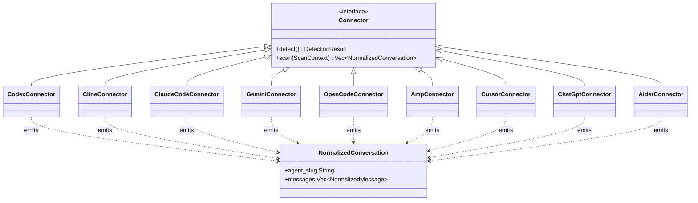
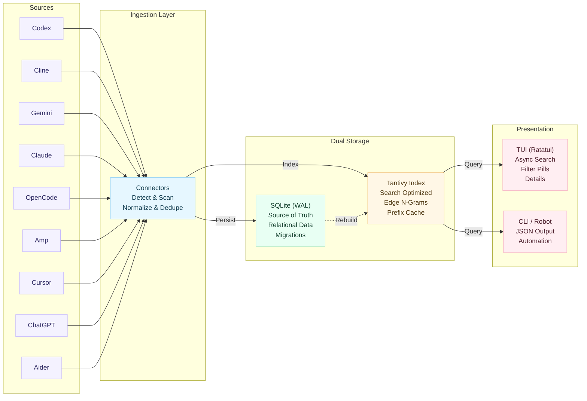
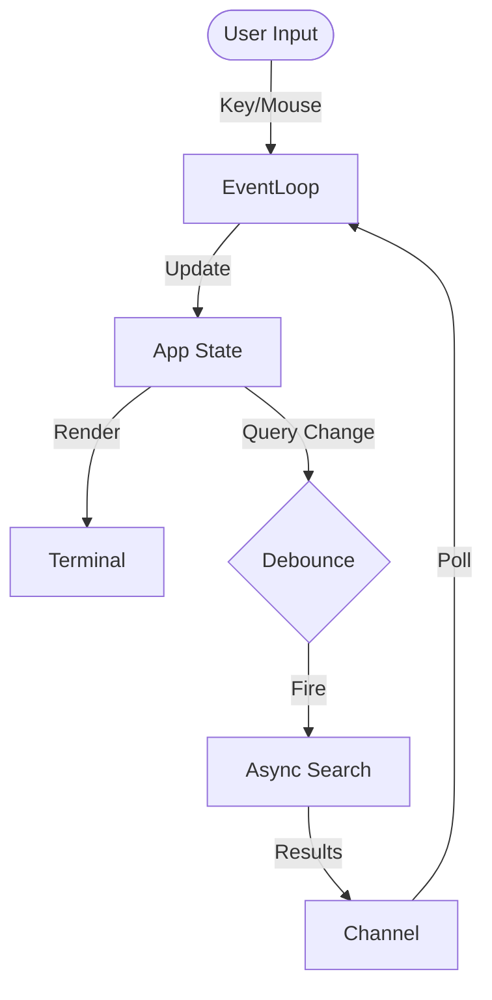

# 🔎 coding-agent-search (cass)


**Unified, high-performance TUI to index and search your local coding agent history.**
Aggregates sessions from Codex, Claude Code, Gemini CLI, Cline, OpenCode, Amp, Cursor, ChatGPT, and Aider into a single, searchable timeline.

<div align="center">

```bash
# Fast path: checksum-verified install + self-test
curl -fsSL https://raw.githubusercontent.com/Dicklesworthstone/coding_agent_session_search/main/install.sh \
  | bash -s -- --easy-mode --verify
```

```powershell
# Windows (PowerShell)
irm https://raw.githubusercontent.com/Dicklesworthstone/coding_agent_session_search/main/install.ps1 | iex
install.ps1 -EasyMode -Verify
```

</div>

---

## 📸 Screenshots

<div align="center">

### Search Results Across All Your Agents
*Three-pane layout: filter bar, results list with color-coded agents (Claude, Codex, Gemini, etc.), and syntax-highlighted detail preview*


---

### Rich Conversation Detail View
*Full conversation rendering with markdown formatting, code blocks, headers, and structured content*


---

### Quick Start & Keyboard Reference
*Built-in help screen (press `F1` or `?`) with all shortcuts, filters, modes, and navigation tips*


</div>

---

## 💡 Why This Exists

### The Problem

AI coding agents are transforming how we write software. Claude Code, Codex, Cursor, Copilot, Aider—each creates a trail of conversations, debugging sessions, and problem-solving attempts. But this wealth of knowledge is **scattered and unsearchable**:

- **Fragmented storage**: Each agent stores data differently—JSONL files, SQLite databases, markdown logs, proprietary JSON formats
- **No cross-agent visibility**: Solutions discovered in Cursor are invisible when you're using Claude Code
- **Lost context**: That brilliant debugging session from two weeks ago? Good luck finding it by scrolling through files
- **No semantic search**: File-based grep doesn't understand code structure or natural language queries

### The Solution

`cass` treats your coding agent history as a **unified knowledge base**. It:

1. **Normalizes** disparate formats into a common schema
2. **Indexes** everything with a purpose-built full-text search engine
3. **Surfaces** relevant past conversations in milliseconds
4. **Respects** your privacy—everything stays local, nothing phones home

### Who Benefits

- **Individual developers**: Find that solution you know you've seen before
- **Teams**: Share institutional knowledge across different tool preferences
- **AI agents themselves**: Let your current agent learn from all your past agents (via robot mode)
- **Power users**: Build workflows that leverage your complete coding history

---

## ✨ Key Features

### ⚡ Instant Search (Sub-60ms Latency)
- **"Search-as-you-type"**: Results update instantly with every keystroke.
- **Edge N-Gram Indexing**: We frontload the work by pre-computing prefix matches (e.g., "cal" -> "calculate") during indexing, trading disk space for O(1) lookup speed at query time.
- **Smart Tokenization**: Handles `snake_case` ("my_var" matches "my" and "var"), hyphenated terms, and code symbols (`c++`, `foo.bar`) correctly.
- **Zero-Stall Updates**: The background indexer commits changes atomically; `reader.reload()` ensures new messages appear in the search bar immediately without restarting.

### 🎯 Advanced Search Features
- **Wildcard Patterns**: Full glob-style pattern support:
  - `foo*` - Prefix match (finds "foobar", "foo123")
  - `*foo` - Suffix match (finds "barfoo", "configfoo")
  - `*foo*` - Substring match (finds "afoob", "configuration")
- **Auto-Fuzzy Fallback**: When exact searches return sparse results, automatically retries with `*term*` wildcards to broaden matches. Visual indicator shows when fallback is active.
- **Query History Deduplication**: Recent searches deduplicated to show unique queries; navigate with `Up`/`Down` arrows.
- **Match Quality Ranking**: New ranking mode (cycle with `F12`) that prioritizes exact matches over wildcard/fuzzy results.
- **Match Highlighting**: Use `--highlight` in robot mode to wrap matching terms with markers (`**bold**` for text, `<mark>` for HTML output).

### 🖥️ Rich Terminal UI (TUI)
- **Three-Pane Layout**: Filter bar (top), scrollable results (left), and syntax-highlighted details (right).
- **Multi-Line Result Display**: Each result shows location and up to 3 lines of context; alternating stripes improve scanability.
- **Live Status**: Footer shows real-time indexing progress—agent discovery count during scanning, then item progress with sparkline visualization (e.g., `📦 Indexing 150/2000 (7%) ▁▂▄▆█`)—plus active filters.
- **Multi-Open Queue**: Queue multiple results with `Ctrl+Enter`, then open all in your editor with `Ctrl+O`. Confirmation prompt for large batches (≥12 items).
- **Find-in-Detail**: Press `/` to search within the detail pane; matches highlighted with `n`/`N` navigation.
- **Mouse Support**: Click to select results, scroll panes, or clear filters.
- **Theming**: Adaptive Dark/Light modes with role-colored messages (User/Assistant/System). Toggle border style (`Ctrl+B`) between rounded Unicode and plain ASCII.
- **Ranking Modes**: Cycle through `recent`/`balanced`/`relevance`/`quality` with `F12`; quality mode penalizes fuzzy matches.

### 🔗 Universal Connectors
Ingests history from all major local agents, normalizing them into a unified `Conversation -> Message -> Snippet` model:
- **Codex**: `~/.codex/sessions` (Rollout JSONL)
- **Cline**: VS Code global storage (Task directories)
- **Gemini CLI**: `~/.gemini/tmp` (Chat JSON)
- **Claude Code**: `~/.claude/projects` (Session JSONL)
- **OpenCode**: `.opencode` directories (SQLite)
- **Amp**: `~/.local/share/amp` & VS Code storage
- **Cursor**: `~/Library/Application Support/Cursor/User/` global + workspace storage (SQLite `state.vscdb`)
- **ChatGPT**: `~/Library/Application Support/com.openai.chat` (v1 unencrypted JSON; v2/v3 encrypted—see Environment)
- **Aider**: `~/.aider.chat.history.md` and per-project `.aider.chat.history.md` files (Markdown)

---

## 🏎️ Performance Engineering: Caching & Warming
To achieve sub-60ms latency on large datasets, `cass` implements a multi-tier caching strategy in `src/search/query.rs`:

1.  **Sharded LRU Cache**: The `prefix_cache` is split into shards (default 256 entries each) to reduce mutex contention during concurrent reads/writes from the async searcher.
2.  **Bloom Filter Pre-checks**: Each cached hit stores a 64-bit Bloom filter mask of its content tokens. When a user types more characters, we check the mask first. If the new token isn't in the mask, we reject the cache entry immediately without a string comparison.
3.  **Predictive Warming**: A background `WarmJob` thread watches the input. When the user pauses typing, it triggers a lightweight "warm-up" query against the Tantivy reader to pre-load relevant index segments into the OS page cache.

## 🔌 The Connector Interface (Polymorphism)
The system is designed for extensibility via the `Connector` trait (`src/connectors/mod.rs`). This allows `cass` to treat disparate log formats as a uniform stream of events.



- **Polymorphic Scanning**: The indexer runs connector factories in parallel via rayon, creating fresh `Box<dyn Connector>` instances that are unaware of each other's underlying file formats (JSONL, SQLite, specialized JSON).
- **Resilient Parsing**: Connectors handle legacy formats (e.g., integer vs ISO timestamps) and flatten complex tool-use blocks into searchable text.

---

## 🧠 Architecture & Engineering

`cass` employs a dual-storage strategy to balance data integrity with search performance.

### The Pipeline
1.  **Ingestion**: Connectors scan proprietary agent files and normalize them into standard structs.
2.  **Storage (SQLite)**: The **Source of Truth**. Data is persisted to a normalized SQLite schema (`messages`, `conversations`, `agents`). This ensures ACID compliance, reliable storage, and supports complex relational queries (stats, grouping).
3.  **Search Index (Tantivy)**: The **Speed Layer**. New messages are incrementally pushed to a Tantivy full-text index. This index is optimized for speed:
    *   **Fields**: `title`, `content`, `agent`, `workspace`, `created_at`.
    *   **Prefix Fields**: `title_prefix` and `content_prefix` use **Index-Time Edge N-Grams** (not stored on disk to save space) for instant prefix matching.
    *   **Deduping**: Search results are deduplicated by content hash to remove noise from repeated tool outputs.



### Background Indexing & Watch Mode
- **Non-Blocking**: The indexer runs in a background thread. You can search while it works.
- **Parallel Discovery**: Connector detection and scanning run in parallel across all CPU cores using rayon, significantly reducing startup time when multiple agents are installed.
- **Watch Mode**: Uses file system watchers (`notify`) to detect changes in agent logs. When you save a file or an agent replies, `cass` re-indexes just that conversation and refreshes the search view automatically.
- **Real-Time Progress**: The TUI footer updates in real-time showing discovered agents during scanning (e.g., "🔍 Discovering (5 agents found)") and indexing progress with sparkline visualization (e.g., "📦 Indexing 150/2000 (7%) ▁▂▄▆█").

## 🔍 Deep Dive: Internals

### The TUI Engine (State Machine & Async Loop)
The interactive interface (`src/ui/tui.rs`) is the largest component (~3.5k lines), implementing a sophisticated **Immediate Mode** architecture using `ratatui`.

1.  **Application State**: A monolithic struct tracks the entire UI state (search query, cursor position, scroll offsets, active filters, and cached details).
2.  **Event Loop**: A polling loop handles standard inputs (keyboard/mouse) and custom events (Search results ready, Progress updates).
3.  **Debouncing**: User input triggers an async search task via a `tokio` channel. To prevent UI freezing, we debounce keystrokes (150ms) and run queries on a separate thread, updating the state only when results return.
4.  **Optimistic Rendering**: The UI renders the *current* state immediately (60 FPS), drawing "stale" results or loading skeletons while waiting for the async searcher.



### Append-Only Storage Strategy
Data integrity is paramount. `cass` treats the SQLite database (`src/storage/sqlite.rs`) as an **append-only log** for conversations:

- **Immutable History**: When an agent adds a message to a conversation, we don't update the existing row. We insert the new message linked to the conversation ID.
- **Deduplication**: The connector layer uses content hashing to prevent duplicate messages if an agent re-writes a file.
- **Versioning**: A `schema_version` meta-table and strict migration path ensure that upgrades (like the recent move to v3) are safe and atomic.

---

## 🔤 Query Language Reference

`cass` supports a rich query syntax designed for both humans and machines.

### Basic Queries

| Query | Matches |
|-------|---------|
| `error` | Messages containing "error" (case-insensitive) |
| `python error` | Messages containing both "python" AND "error" |
| `"authentication failed"` | Exact phrase match |
| `auth fail` | Both terms, in any order |

### Wildcard Patterns

| Pattern | Type | Matches | Performance |
|---------|------|---------|-------------|
| `auth*` | Prefix | "auth", "authentication", "authorize" | Fast (uses edge n-grams) |
| `*tion` | Suffix | "authentication", "function", "exception" | Slower (regex scan) |
| `*config*` | Substring | "reconfigure", "config.json", "misconfigured" | Slowest (full regex) |
| `test_*` | Prefix | "test_user", "test_auth", "test_helpers" | Fast |

**Tip**: Prefix wildcards (`foo*`) are optimized via pre-computed edge n-grams. Suffix and substring wildcards fall back to regex and are slower on large indexes.

### Query Modifiers

```bash
# Field-specific search (in robot mode)
cass search "error" --agent claude --workspace /path/to/project

# Time-bounded search
cass search "bug" --since 2024-01-01 --until 2024-01-31
cass search "bug" --today
cass search "bug" --days 7

# Combined filters
cass search "authentication" --agent codex --workspace myproject --week
```

### Match Types

Search results include a `match_type` indicator:

| Type | Meaning | Score Boost |
|------|---------|-------------|
| `exact` | Query terms found verbatim | Highest |
| `prefix` | Matched via prefix expansion (e.g., `auth*`) | High |
| `suffix` | Matched via suffix pattern | Medium |
| `substring` | Matched via substring pattern | Lower |
| `fuzzy` | Auto-fallback match when exact results sparse | Lowest |

### Auto-Fuzzy Fallback

When an exact query returns fewer than 3 results, `cass` automatically retries with wildcard expansion:
- `auth` → `*auth*`
- Results are flagged with `wildcard_fallback: true` in robot mode
- TUI shows a "fuzzy" indicator in the status bar

---

## ⌨️ Complete Keyboard Reference

### Global Keys

| Key | Action |
|-----|--------|
| `Ctrl+C` | Quit |
| `F1` or `?` | Toggle help screen |
| `F2` | Toggle dark/light theme |
| `Ctrl+B` | Toggle border style (rounded/plain) |
| `Ctrl+Shift+R` | Force re-index |
| `Ctrl+Shift+Del` | Reset all TUI state |

### Search Bar (Query Input)

| Key | Action |
|-----|--------|
| Type | Live search as you type |
| `Enter` | Open selected result in `$EDITOR` |
| `Esc` | Clear query / exit search |
| `Up`/`Down` | Navigate query history |
| `Ctrl+R` | Cycle through query history |
| `Backspace` | Delete character; if empty, remove last filter chip |

### Navigation

| Key | Action |
|-----|--------|
| `Up`/`Down` | Move selection in results list |
| `Left`/`Right` | Switch focus between results and detail pane |
| `Tab`/`Shift+Tab` | Cycle focus: search → results → detail |
| `PageUp`/`PageDown` | Scroll by page |
| `Home`/`End` | Jump to first/last result |
| `Alt+h/j/k/l` | Vim-style navigation (left/down/up/right) |

### Filtering

| Key | Action |
|-----|--------|
| `F3` | Open agent filter palette |
| `F4` | Open workspace filter palette |
| `F5` | Set "from" time filter |
| `F6` | Set "to" time filter |
| `Shift+F3` | Scope to currently selected result's agent |
| `Shift+F4` | Clear workspace filter |
| `Shift+F5` | Cycle time presets: 24h → 7d → 30d → all |
| `Ctrl+Del` | Clear all active filters |

### Modes & Display

| Key | Action |
|-----|--------|
| `F7` | Cycle context window size: S → M → L → XL |
| `F9` | Toggle match mode: prefix (default) ↔ standard |
| `F12` | Cycle ranking: recent → balanced → relevance → quality |
| `Shift+`/`=` | Increase items per pane (density) |
| `-` | Decrease items per pane |

### Selection & Actions

| Key | Action |
|-----|--------|
| `m` | Toggle selection on current result |
| `Ctrl+A` | Select/deselect all visible results |
| `A` | Open bulk actions menu (when items selected) |
| `Ctrl+Enter` | Add to multi-open queue |
| `Ctrl+O` | Open all queued items in editor |
| `y` | Copy current item (path or content to clipboard) |
| `Ctrl+Y` | Copy all selected items |

### Detail Pane

| Key | Action |
|-----|--------|
| `Space` | Toggle full-screen detail view |
| `/` | Start find-in-detail search |
| `n` | Jump to next match (in find mode) |
| `N` | Jump to previous match |
| `g` | Scroll to top (in full-screen) |
| `G` | Scroll to bottom (in full-screen) |
| `c` | Copy visible content |
| `o` | Open in external viewer |

### Mouse Support

- **Click** on result to select
- **Click** on filter chip to edit/remove
- **Scroll** in any pane
- **Double-click** to open result

---

## 📊 Ranking & Scoring Explained

### The Four Ranking Modes

Cycle through modes with `F12`:

1. **Recent Heavy** (default): Strongly favors recent conversations
   - Score = `text_relevance × 0.3 + recency × 0.7`
   - Best for: "What was I working on?"

2. **Balanced**: Equal weight to relevance and recency
   - Score = `text_relevance × 0.5 + recency × 0.5`
   - Best for: General-purpose search

3. **Relevance**: Prioritizes text match quality
   - Score = `text_relevance × 0.8 + recency × 0.2`
   - Best for: "Find the best explanation of X"

4. **Match Quality**: Penalizes fuzzy/wildcard matches
   - Score = `text_relevance × 0.7 + recency × 0.2 + match_exactness × 0.1`
   - Best for: Precise technical searches

### Score Components

- **Text Relevance (BM25)**: Tantivy's implementation of Okapi BM25, considering:
  - Term frequency in document
  - Inverse document frequency across corpus
  - Document length normalization

- **Recency**: Exponential decay from current time
  - Documents from today: ~1.0
  - Documents from last week: ~0.7
  - Documents from last month: ~0.3

- **Match Exactness**: Bonus for exact matches vs wildcards
  - Exact phrase: 1.0
  - Prefix match: 0.8
  - Suffix/Substring: 0.5
  - Fuzzy fallback: 0.3

---

## 🔄 The Normalization Pipeline

Each connector transforms agent-specific formats into a unified schema:

```
┌─────────────────┐     ┌──────────────────┐     ┌─────────────────┐
│  Agent Files    │ ──▶ │    Connector     │ ──▶ │  Normalized     │
│  (proprietary)  │     │  (per-agent)     │     │  Conversation   │
└─────────────────┘     └──────────────────┘     └─────────────────┘
     JSONL                   detect()                agent_slug
     SQLite                  scan()                  workspace
     Markdown                                        messages[]
     JSON                                            created_at
```

### Role Normalization

Different agents use different role names:

| Agent | Original | Normalized |
|-------|----------|------------|
| Claude Code | `human`, `assistant` | `user`, `assistant` |
| Codex | `user`, `assistant` | `user`, `assistant` |
| ChatGPT | `user`, `assistant`, `system` | `user`, `assistant`, `system` |
| Cursor | `user`, `assistant` | `user`, `assistant` |
| Aider | (markdown headers) | `user`, `assistant` |

### Timestamp Handling

Agents store timestamps inconsistently:

| Format | Example | Handling |
|--------|---------|----------|
| Unix milliseconds | `1699900000000` | Direct conversion |
| Unix seconds | `1699900000` | Multiply by 1000 |
| ISO 8601 | `2024-01-15T10:30:00Z` | Parse with chrono |
| Missing | `null` | Use file modification time |

### Content Flattening

Tool calls, code blocks, and nested structures are flattened for searchability:

```json
// Original (Claude Code)
{"type": "tool_use", "name": "Read", "input": {"path": "/foo/bar.rs"}}

// Flattened for indexing
"[Tool: Read] path=/foo/bar.rs"
```

---

## 🧹 Deduplication Strategy

The same conversation content can appear multiple times due to:
- Agent file rewrites
- Backup files
- Symlinked directories
- Re-indexing

### Content-Based Deduplication

`cass` uses a multi-layer deduplication strategy:

1. **Message Hash**: SHA-256 of `(role + content + timestamp)`
   - Identical messages in different files are stored once

2. **Conversation Fingerprint**: Hash of first N message hashes
   - Detects duplicate conversation files

3. **Search-Time Dedup**: Results are deduplicated by content similarity
   - Even if stored twice, shown once in results

### Noise Filtering

Common low-value content is filtered from results:
- Empty messages
- Pure whitespace
- System prompts (unless searching for them)
- Repeated tool acknowledgments

---

## 💼 Use Cases & Workflows

### 1. "I solved this before..."

```bash
# Find past solutions for similar errors
cass search "TypeError: Cannot read property" --days 30

# In TUI: F12 to switch to "relevance" mode for best matches
```

### 2. Cross-Agent Knowledge Transfer

```bash
# What has ANY agent said about authentication in this project?
cass search "authentication" --workspace /path/to/project

# Export findings for a new agent's context
cass export /path/to/relevant/session.jsonl --format markdown
```

### 3. Daily/Weekly Review

```bash
# What did I work on today?
cass timeline --today --json | jq '.groups[].conversations'

# TUI: Press Shift+F5 to cycle through time filters
```

### 4. Debugging Workflow Archaeology

```bash
# Find all debugging sessions for a specific file
cass search "debug src/auth/login.rs" --agent claude

# Expand context around a specific line in a session
cass expand /path/to/session.jsonl -n 150 -C 10
```

### 5. Agent-to-Agent Handoff

```bash
# Current agent searches what previous agents learned
cass search "database migration strategy" --robot --fields minimal

# Get full context for a relevant session
cass view /path/to/session.jsonl -n 42 --json
```

### 6. Building Training Data

```bash
# Export high-quality problem-solving sessions
cass search "bug fix" --robot --limit 100 | \
  jq '.hits[] | select(.score > 0.8)' > training_candidates.json
```

---

## 🚀 Quickstart

### 1. Install
```bash
curl -fsSL https://raw.githubusercontent.com/Dicklesworthstone/coding_agent_session_search/main/install.sh \
  | bash -s -- --easy-mode --verify
```

### 2. Launch
```bash
cass
```
*On first run, `cass` performs a full index. You'll see progress in the footer. Search works immediately (falling back to SQLite or partial results until complete).*

### 3. Usage
- **Type to search**: "python error", "refactor auth", "c++".
- **Wildcards**: Use `foo*` (prefix), `*foo` (suffix), or `*foo*` (contains) for flexible matching.
- **Navigation**: `Up`/`Down` to select, `Right` to focus detail pane. `Up`/`Down` in search bar navigates query history.
- **Filters**:
    - `F3`: Filter by Agent (e.g., "codex").
    - `F4`: Filter by Workspace/Project.
    - `F5`/`F6`: Time filters (Today, Week, etc.).
- **Modes**:
    - `F2`: Toggle Dark/Light theme.
    - `F12`: Cycle ranking mode (recent → balanced → relevance → quality).
    - `Ctrl+B`: Toggle rounded/plain borders.
- **Actions**:
    - `Enter`: Open original log file in `$EDITOR`.
    - `Ctrl+Enter`: Add current result to queue (multi-open).
    - `Ctrl+O`: Open all queued results in editor.
    - `m`: Toggle selection on current item.
    - `A`: Bulk actions menu (when items selected).
    - `y`: Copy file path or snippet to clipboard.
    - `/`: Find text within detail pane.
    - `Ctrl+Shift+R`: Trigger manual re-index (refresh search results).
    - `Ctrl+Shift+Del`: Reset TUI state (clear history, filters, layout).

---

## 🛠️ CLI Reference

The `cass` binary supports both interactive use and automation.

```bash
# Interactive
cass [tui] [--data-dir DIR] [--once]

# Indexing
cass index [--full] [--watch] [--data-dir DIR] [--idempotency-key KEY]

# Search
cass search "query" --robot --limit 5 [--timeout 5000] [--explain] [--dry-run]
cass search "error" --robot --aggregate agent,workspace --fields minimal

# Inspection & Health
cass status --json                    # Quick health snapshot
cass health                           # Minimal pre-flight check (<50ms)
cass capabilities --json              # Feature discovery
cass introspect --json                # Full API schema
cass context /path/to/session --json  # Find related sessions
cass view /path/to/file -n 42 --json  # View source at line

# Session Analysis
cass export /path/to/session --format markdown -o out.md  # Export conversation
cass expand /path/to/session -n 42 -C 5 --json            # Context around line
cass timeline --today --json                               # Activity timeline

# Utilities
cass stats --json
cass completions bash > ~/.bash_completion.d/cass
```

### Core Commands

| Command | Purpose |
|---------|---------|
| `cass` (default) | Start TUI + background watcher |
| `index --full` | Complete rebuild of DB and search index |
| `index --watch` | Daemon mode: watch for file changes, reindex automatically |
| `search --robot` | JSON output for automation pipelines |
| `status` / `state` | Health snapshot: index freshness, DB stats, recommended action |
| `health` | Minimal health check (<50ms), exit 0=healthy, 1=unhealthy |
| `capabilities` | Discover features, versions, limits (for agent introspection) |
| `introspect` | Full API schema: commands, arguments, response shapes |
| `context <path>` | Find sessions related by workspace, day, or agent |
| `view <path> -n N` | View source file at specific line (follow-up on search) |
| `export <path>` | Export conversation to markdown/HTML/JSON |
| `expand <path> -n N` | Show messages around a specific line number |
| `timeline` | Activity timeline with grouping by hour/day |

## 🤖 AI / Automation Mode

`cass` is purpose-built for consumption by AI coding agents—not just as an afterthought, but as a first-class design goal. When you're an AI agent working on a codebase, your own session history and those of other agents become an invaluable knowledge base: solutions to similar problems, context about design decisions, debugging approaches that worked, and institutional memory that would otherwise be lost.

### Why Cross-Agent Search Matters

Imagine you're Claude Code working on a React authentication bug. With `cass`, you can instantly search across:
- Your own previous sessions where you solved similar auth issues
- Codex sessions where someone debugged OAuth flows
- Cursor conversations about token refresh patterns
- Aider chats about security best practices

This cross-pollination of knowledge across different AI agents is transformative. Each agent has different strengths, different context windows, and encounters different problems. `cass` unifies all this collective intelligence into a single, searchable index.

### Self-Documenting API

`cass` teaches agents how to use it—no external documentation required:

```bash
# Quick capability check: what features exist?
cass capabilities --json
# → {"features": ["json_output", "cursor_pagination", "highlight_matches", ...], "connectors": [...], "limits": {...}}

# Full API schema with argument types, defaults, and response shapes
cass introspect --json

# Topic-based help optimized for LLM consumption
cass robot-docs commands    # All commands and flags
cass robot-docs schemas     # Response JSON schemas
cass robot-docs examples    # Copy-paste invocations
cass robot-docs exit-codes  # Error handling guide
cass robot-docs guide       # Quick-start walkthrough
```

### Forgiving Syntax (Agent-Friendly Parsing)

AI agents sometimes make syntax mistakes. `cass` aggressively normalizes input to maximize acceptance when intent is clear:

| What you type | What `cass` understands | Correction note |
|---------------|------------------------|-----------------|
| `cass serach "error"` | `cass search "error"` | "Did you mean 'search'?" |
| `cass -robot -limit=5` | `cass --robot --limit=5` | Single-dash long flags normalized |
| `cass --Robot --LIMIT 5` | `cass --robot --limit 5` | Case normalized |
| `cass find "auth"` | `cass search "auth"` | `find`/`query`/`q` → `search` |
| `cass --robot-docs` | `cass robot-docs` | Flag-as-subcommand detected |
| `cass search --limt 5` | `cass search --limit 5` | Levenshtein distance ≤2 corrected |

The CLI applies multiple normalization layers:
1. **Typo correction**: Flags within edit distance 2 are auto-corrected
2. **Case normalization**: `--Robot`, `--LIMIT` → `--robot`, `--limit`
3. **Single-dash recovery**: `-robot` → `--robot` (common LLM mistake)
4. **Subcommand aliases**: `find`/`query`/`q` → `search`, `ls`/`list` → `stats`
5. **Global flag hoisting**: Position-independent flag handling

When corrections are applied, `cass` emits a teaching note to stderr so agents learn the canonical syntax.

### Structured Output Formats

Every command supports machine-readable output:

```bash
# Pretty-printed JSON (default robot mode)
cass search "error" --robot

# Streaming JSONL: header line with _meta, then one hit per line
cass search "error" --robot-format jsonl

# Compact single-line JSON (minimal bytes)
cass search "error" --robot-format compact

# Include performance metadata
cass search "error" --robot --robot-meta
# → { "hits": [...], "_meta": { "elapsed_ms": 12, "cache_hit": true, "wildcard_fallback": false, ... } }
```

**Design principle**: stdout contains only parseable JSON data; all diagnostics, warnings, and progress go to stderr.

### Token Budget Management

LLMs have context limits. `cass` provides multiple levers to control output size:

| Flag | Effect |
|------|--------|
| `--fields minimal` | Only `source_path`, `line_number`, `agent` |
| `--fields summary` | Adds `title`, `score` |
| `--fields score,title,snippet` | Custom field selection |
| `--max-content-length 500` | Truncate long fields (UTF-8 safe, adds "...") |
| `--max-tokens 2000` | Soft budget (~4 chars/token); adjusts truncation dynamically |
| `--limit 5` | Cap number of results |

Truncated fields include a `*_truncated: true` indicator so agents know when they're seeing partial content.

### Error Handling for Agents

Errors are structured, actionable, and include recovery hints:

```json
{
  "error": {
    "code": 3,
    "kind": "index_missing",
    "message": "Search index not found",
    "hint": "Run 'cass index --full' to build the index",
    "retryable": false
  }
}
```

**Exit codes** follow a semantic convention:
| Code | Meaning | Typical action |
|------|---------|----------------|
| 0 | Success | Parse stdout |
| 2 | Usage error | Fix syntax (hint provided) |
| 3 | Index missing | Run `cass index --full` |
| 4 | Not found | Try different query/path |
| 5 | Idempotency mismatch | Retry with new key |
| 9 | Unknown error | Check `retryable` flag |
| 10 | Timeout exceeded | Increase `--timeout` or reduce scope |

The `retryable` field tells agents whether a retry might succeed (e.g., transient I/O) vs. guaranteed failure (e.g., invalid path).

### Session Analysis Commands

Beyond search, `cass` provides commands for deep-diving into specific sessions:

```bash
# Export full conversation to shareable format
cass export /path/to/session.jsonl --format markdown -o conversation.md
cass export /path/to/session.jsonl --format html -o conversation.html
cass export /path/to/session.jsonl --format json --include-tools

# Expand context around a specific line (from search result)
cass expand /path/to/session.jsonl -n 42 -C 5 --json
# → Shows 5 messages before and after line 42

# Activity timeline: when were agents active?
cass timeline --today --json --group-by hour
cass timeline --since 7d --agent claude --json
# → Grouped activity counts, useful for understanding work patterns
```

### Match Highlighting

The `--highlight` flag wraps matching terms for visual/programmatic identification:

```bash
cass search "authentication error" --robot --highlight
# In text output: **authentication** and **error** are bold-wrapped
# In HTML export: <mark>authentication</mark> and <mark>error</mark>
```

Highlighting is query-aware: quoted phrases like `"auth error"` highlight as a unit; individual terms highlight separately.

### Pagination & Cursors

For large result sets, use cursor-based pagination:

```bash
# First page
cass search "TODO" --robot --robot-meta --limit 20
# → { "hits": [...], "_meta": { "next_cursor": "eyJ..." } }

# Next page
cass search "TODO" --robot --robot-meta --limit 20 --cursor "eyJ..."
```

Cursors are opaque tokens encoding the pagination state. They remain valid as long as the index isn't rebuilt.

### Request Correlation

For debugging and logging, attach a request ID:

```bash
cass search "bug" --robot --request-id "req-12345"
# → { "hits": [...], "_meta": { "request_id": "req-12345" } }
```

### Idempotent Operations

For safe retries (e.g., in CI pipelines or flaky networks):

```bash
cass index --full --idempotency-key "build-$(date +%Y%m%d)"
# If same key + params were used in last 24h, returns cached result
```

### Query Analysis

Debug why a search returned unexpected results:

```bash
cass search "auth*" --robot --explain
# → Includes parsed query AST, term expansion, cost estimates

cass search "auth error" --robot --dry-run
# → Validates query syntax without executing
```

### Traceability

For debugging agent pipelines:

```bash
cass search "error" --robot --trace-file /tmp/cass-trace.json
# Appends execution span with timing, exit code, and command details
```

### Search Flags Reference

| Flag | Purpose |
|------|---------|
| `--robot` / `--json` | JSON output (pretty-printed) |
| `--robot-format jsonl\|compact` | Streaming or single-line JSON |
| `--robot-meta` | Include `_meta` block (elapsed_ms, cache stats, index freshness) |
| `--fields minimal\|summary\|<list>` | Reduce payload size |
| `--max-content-length N` | Truncate content fields to N chars |
| `--max-tokens N` | Soft token budget (~4 chars/token) |
| `--timeout N` | Timeout in milliseconds; returns partial results on expiry |
| `--cursor <token>` | Cursor-based pagination (from `_meta.next_cursor`) |
| `--request-id ID` | Echoed in response for correlation |
| `--aggregate agent,workspace,date` | Server-side aggregations |
| `--explain` | Include query analysis (parsed query, cost estimate) |
| `--dry-run` | Validate query without executing |
| `--highlight` | Wrap matching terms with markers |

### Index Flags Reference

| Flag | Purpose |
|------|---------|
| `--idempotency-key KEY` | Safe retries: same key + params returns cached result (24h TTL) |
| `--json` | JSON output with stats |

### Ready-to-paste blurb for AGENTS.md / CLAUDE.md

> **cass (Coding Agent Session Search)** — High-performance local search for agent history.
> - **Discovery**: `cass capabilities --json` or `cass introspect --json`.
> - **Search**: `cass search "query" --robot --robot-meta --fields minimal [--highlight]`.
> - **Paginate**: Use `_meta.next_cursor` → `--cursor <value>`.
> - **Context**: `cass context <path> --json` (related sessions).
> - **Inspect**: `cass view <source_path> -n <line> --json`.
> - **Expand**: `cass expand <path> -n <line> -C 3 --json` (messages around line).
> - **Export**: `cass export <path> --format markdown` (full conversation).
> - **Timeline**: `cass timeline --today --json` (activity overview).
> - **Health**: `cass health` (exit 0=ok, 1=unhealthy).
> - **Manage**: `cass index --full --idempotency-key <key>`.
> - **Design**: stdout is data-only JSON; stderr is diagnostics.

---

## 🔒 Integrity & Safety

- **Verified Install**: The installer enforces SHA256 checksums.

- **Sandboxed Data**: All indexes/DBs live in standard platform data directories (`~/.local/share/coding-agent-search` on Linux).

- **Read-Only Source**: `cass` *never* modifies your agent log files. It only reads them.


## 📦 Installer Strategy

The project ships with a robust installer (`install.sh` / `install.ps1`) designed for CI/CD and local use:

- **Checksum Verification**: Validates artifacts against a `.sha256` file or explicit `--checksum` flag.

- **Rustup Bootstrap**: Automatically installs the nightly toolchain if missing.

- **Easy Mode**: `--easy-mode` automates installation to `~/.local/bin` without prompts.

- **Platform Agnostic**: Detects OS/Arch (Linux/macOS/Windows, x86_64/arm64) and fetches the correct binary.


## ⚙️ Environment

- **Config**: Loads `.env` via `dotenvy::dotenv().ok()`; configure API/base paths there. Do not overwrite `.env`.

- **Data Location**: Defaults to standard platform data directories (e.g., `~/.local/share/coding-agent-search`). Override with `CASS_DATA_DIR` or `--data-dir`.

- **ChatGPT Support**: The ChatGPT macOS app stores conversations in versioned formats:
  - **v1** (legacy): Unencrypted JSON in `conversations-{uuid}/` — fully indexed.
  - **v2/v3**: Encrypted with AES-256-GCM, key stored in macOS Keychain (OpenAI-signed apps only) — detected but skipped.

  Encrypted conversations require keychain access which isn't available to third-party apps. Legacy unencrypted conversations are indexed automatically.

- **Logs**: Written to `cass.log` (daily rotating) in the data directory.

- **Updates**: Interactive TUI checks for GitHub releases on startup. Skip with `CODING_AGENT_SEARCH_NO_UPDATE_PROMPT=1` or `TUI_HEADLESS=1`.

- **Cache tuning**: `CASS_CACHE_SHARD_CAP` (per-shard entries, default 256) and `CASS_CACHE_TOTAL_CAP` (total cached hits across shards, default 2048) control prefix cache size; raise cautiously to avoid memory bloat.

- **Cache debug**: set `CASS_DEBUG_CACHE_METRICS=1` to emit cache hit/miss/shortfall/reload stats via tracing (debug level).

- **Watch testing (dev only)**: `cass index --watch --watch-once path1,path2` triggers a single reindex without filesystem notify (also respects `CASS_TEST_WATCH_PATHS` for backward compatibility); useful for deterministic tests/smoke runs.


## 🩺 Troubleshooting

- **Checksum mismatch**: Ensure `.sha256` is reachable or pass `--checksum` explicitly. Check proxies/firewalls.

- **Binary not on PATH**: Append `~/.local/bin` (or your `--dest`) to `PATH`; re-open shell.

- **Nightly missing in CI**: Set `RUSTUP_INIT_SKIP=1` if toolchain is preinstalled; otherwise allow installer to run rustup.

- **Watch mode not triggering**: Confirm `watch_state.json` updates and that connector roots are accessible; `notify` relies on OS file events (inotify/FSEvents).

- **Reset TUI state**: Run `cass tui --reset-state` (or press `Ctrl+Shift+Del` in the TUI) to delete `tui_state.json` and restore defaults.


## 🧪 Developer Workflow

We target **Rust Nightly** to leverage the latest optimizations.


```bash

# Format & Lint

cargo fmt --check

cargo clippy --all-targets -- -D warnings


# Build & Test

cargo build --release

cargo test


# Run End-to-End Tests

cargo test --test e2e_index_tui

cargo test --test install_scripts

```


## 🤝 Contributing

- Follow the nightly toolchain policy and run `fmt`/`clippy`/`test` before sending changes.

- Keep console output colorful and informative.

- Avoid destructive commands; do not use regex-based mass scripts in this repo.


## 🔍 Deep Dive: How Key Subsystems Work

### Tantivy schema & preview field (v4)
- Schema v4 (hash `tantivy-schema-v4-edge-ngram-preview`) stores agent/workspace/source_path/msg_idx/created_at/title/content plus edge-ngrams (`title_prefix`, `content_prefix`) for type-ahead matching.
- New `preview` field keeps a short, stored excerpt (~200 chars + ellipsis) so prefix-only queries can render snippets without pulling full content.
- Rebuilds auto-trigger when the schema hash changes; index directory is recreated as needed. Tokenizer: `hyphen_normalize` to keep “cma-es” searchable while enabling prefix splits.

### Search pipeline (src/search/query.rs)
- **Wildcard patterns**: `WildcardPattern` enum supports `Exact`, `Prefix` (foo*), `Suffix` (*foo), and `Substring` (*foo*). Prefix uses edge n-grams; suffix/substring use Tantivy `RegexQuery` with escaped special characters.
- **Auto-fuzzy fallback**: `search_with_fallback()` wraps the base search; if results < threshold and query has no wildcards, retries with `*term*` patterns and sets `wildcard_fallback` flag for UI indicator.
- Cache-first: per-agent + global LRU shards (env `CASS_CACHE_SHARD_CAP`, default 256). Cached hits store lowered content/title/snippet and a 64-bit bloom mask; bloom + substring keeps validation fast.
- Fallback order: Tantivy (primary) → SQLite FTS (consistency) with deduping/noise filtering. Prefix-only snippet path tries cached prefix snippet, then a cheap local snippet, else Tantivy `SnippetGenerator`.
- Warm worker: runtime-aware, debounced (env `CASS_WARM_DEBOUNCE_MS`, default 120 ms), runs a tiny 1-doc search to keep the reader hot; reloads are debounced (300 ms) and counted in metrics (cache hit/miss/shortfall/reloads tracked internally).

### Indexer (src/indexer/mod.rs)
- Opens SQLite + Tantivy; `--full` clears tables/FTS and wipes Tantivy docs; `--force-rebuild` recreates index dir when schema changes.
- Parallel connector loop: detect → scan runs concurrently across all connectors using rayon's parallel iterator, with atomic progress counters updating discovered agent count and conversation totals in real-time. Ingestion into SQLite and Tantivy happens sequentially after all scans complete. Watch mode: debounced filesystem watcher, path classification per connector, since_ts tracked in `watch_state.json`, incremental reindex of touched sources. TUI startup spawns a background indexer with watch enabled.

### Storage (src/storage/sqlite.rs)
- Normalized relational model (agents, workspaces, conversations, messages, snippets, tags) with FTS mirror on messages. Single-transaction insert/upsert, append-only unless `--full`. `schema_version` guard; bundled modern SQLite.

### UI (src/ui/tui.rs)
- Three-pane layout (agents → results → detail), responsive splits, focus model (Tab/Shift+Tab), mouse support. Detail tabs (Messages/Snippets/Raw) plus full-screen modal with role colors, code blocks, JSON pretty-print, highlights. Footer packs shortcuts + mode badges; state persisted in `tui_state.json`.

### Connectors (src/connectors/*.rs)
- Each connector implements `detect` (root discovery) and `scan` (since_ts-aware ingestion). External IDs preserved for dedupe; workspace/source paths carried through; roles normalized.

### Installers (install.sh / install.ps1)
- Checksum-verified easy/normal modes, optional quickstart (index on first run), rustup bootstrap if needed. PATH hints appended with warnings; SHA256 required.

### Benchmarks & Tests
- Benches: `index_perf` measures full index build; `runtime_perf` covers search latency + indexing micro-cases.
- Tests: unit + integration + headless TUI e2e; installer checksum fixtures; watch-mode and index/search integration; cache/bloom UTF-8 safety and bloom gate tests.

## 📜 License

MIT. See [LICENSE](LICENSE) for details.
